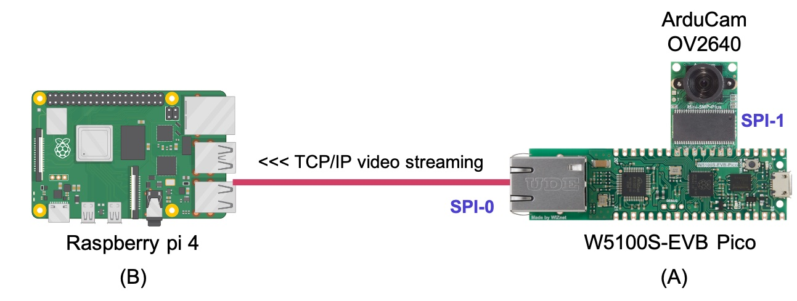
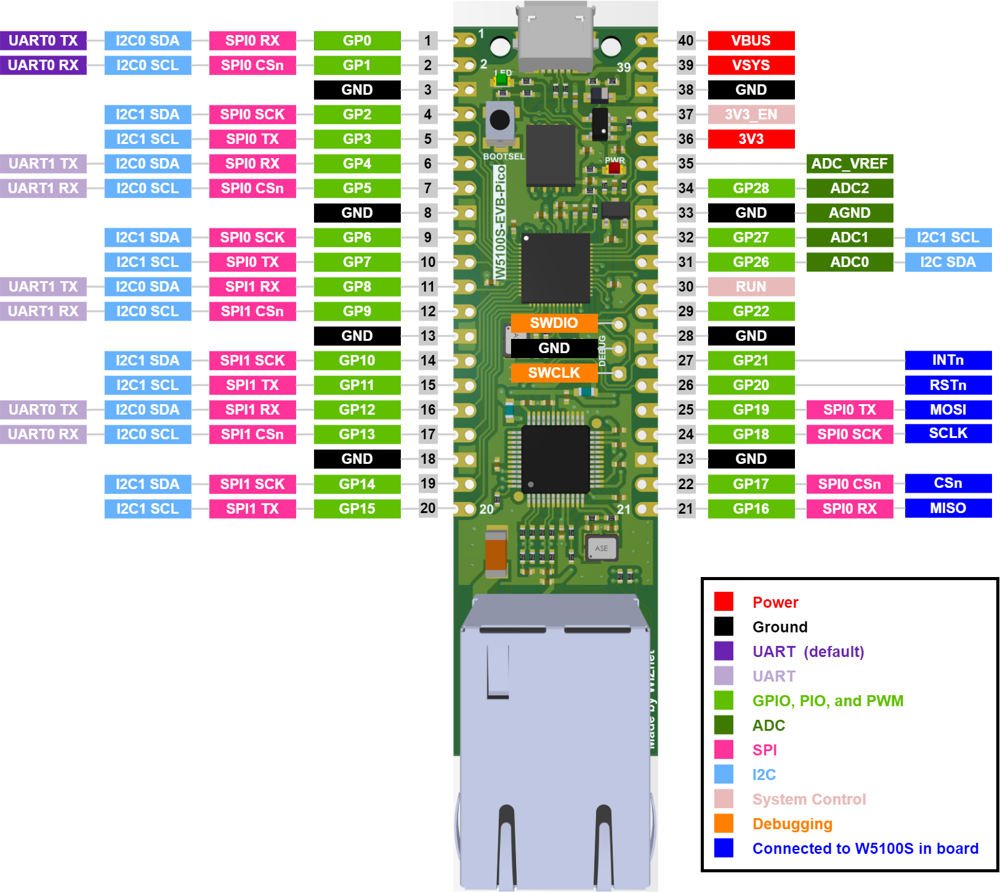
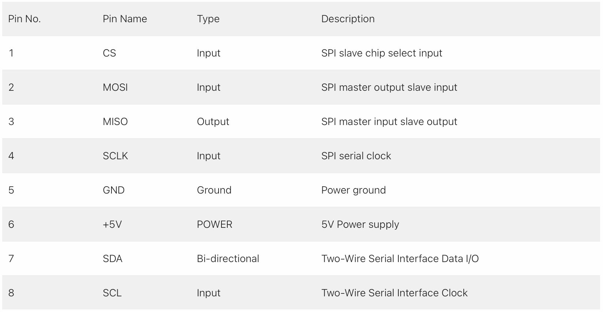

# WIZnet-EVB-Pico-ArduCam

This project implements TCP/IP socket based video streaming using the WIZnet W5100S-EVB-Pico board and <a href="https://www.arducam.com/product/arducam-2mp-spi-camera-b0067-arduino/">ArduCam Mini 2MP Plus - SPI Camera Module (OV2640)</a>.
This project was implemented on Arduino for video capturing and sending part. And Python was used for receiving part.

**Diagram**

The W5100S-EVB-Pico board captures JPEG images from the ArduCam OV2640 Module and sends the JPEG images to the TCP/IP socket server through W5100S ethernet continuously. The receiver on the Raspberry pi receives the jpeg image as a video frame from the TCP/IP socket connection.

For the same, we need to configure SPIs properly for ArduCam OV2640 Module and W5100S ethernet chip.

# How to configure SPI for ArduCam Mini 2MP Plus - SPI Camera Module on W5100S-EVB-Pico board

**WIZnet W5100S-EVB-Pico**

The WIZnet W5100S-EVB-Pico board uses default SPI0 for the internal ethernet chip W5100S. It uses GPIO pin 21~22 and 24~27.

The ArduCam provides <a href="https://www.arducam.com/docs/pico/arducam-camera-module-for-raspberry-pi-pico/spi-camera-for-raspberry-pi-pico/">a document and source codes "SPI Camera for Raspberry Pi Pico"</a> and it also uses SPI0. To avoid the confliction, this project uses SPI1 for the ArduCam OV2600 Module.

**ArduCam Mini 2MP Plus - SPI Camera Module - Pin Definition**

ArduCam OV2640 Module requires CS, MOSI, MISO, SCLK pins for SPI connection, and SDA, SCL pins for I2C connection. This project modified the source code of ArduCam to use SPI1.

**SPI1 configuration for ArduCam OV2640**

1. CS --> GPIO 13
2. MOSI --> GPIO 11
3. MISO --> GPIO 12
4. SCLK --> GPIO 10

**I2C configuration for ArduCam OV2640**

1. SDA --> GPIO 8
2. SCL --> GPIO 9

#References

1. https://www.wiznet.io/product-item/w5100s-evb-pico/
2. https://www.arducam.com/docs/pico/arducam-camera-module-for-raspberry-pi-pico/spi-camera-for-raspberry-pi-pico/
3. https://github.com/ArduCAM/PICO_SPI_CAM
